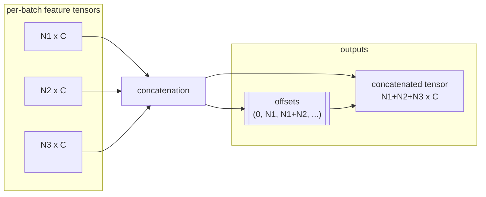

# Geometry Types

See also: the step-by-step [Geometry Tutorial](geometry_tutorial.md).

WarpConvNet defines a set of geometry containers that combine batched coordinates and features. They provide utility functions for neighbor search, conversions and indexing. The tests in `tests/types` showcase typical usage while the source code under `warpconvnet/geometry/types` contains the full definitions.

## Ragged batches, concatenation, and `offsets`

Real-world point clouds and sparse voxel sets are ragged: each batch item has a different number of elements. Instead of padding to `B x N x C`, WarpConvNet concatenates along the first dimension to produce `(N1+...+NB) x C`, and uses an integer `offsets` tensor of length `B+1` to mark segment boundaries.

You may construct geometry either from a list of per-batch tensors or from concatenated tensors plus `offsets`.

## Type catalog

Below is a concise catalog of the core geometry containers. See the API pages under `docs/api` for complete reference and the tests in `tests/types` for runnable examples.

### Points

- Purpose: unordered positions with per-point features
- Build: per-batch lists or concatenated tensors + `offsets`
- Key utils: voxel downsampling, neighbor search
- Examples: `tests/types/test_points.py`

### Voxels

- Purpose: integer grid coordinates with features
- Build: per-batch lists or concatenated tensors + `offsets`
- Key utils: to/from dense, hashing/indexing
- Examples: `tests/types/test_voxels.py`

### Grid

- Purpose: dense voxel grid with fixed shape and memory format
- Build: `Grid.from_shape` and conversion helpers (e.g., `points_to_grid`)
- Key utils: memory formats, layout conversions
- Examples: `tests/types/test_grid.py`, `tests/types/test_to_grid.py`

### FactorGrid

- Purpose: group multiple `Grid` objects with factorized memory formats
- Build: `FactorGrid.create_from_grid_shape`
- Key utils: factor-specific memory layouts and conversions
- Examples: `tests/types/test_factor_grid.py`

For complete API documentation consult the modules under `warpconvnet/geometry/types/` and the generated pages in `docs/api/`.
